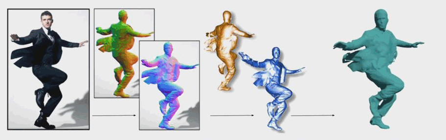
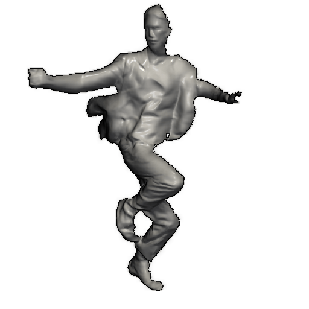
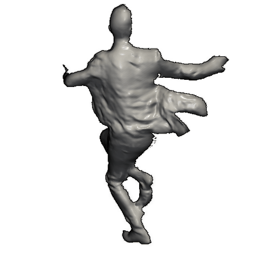
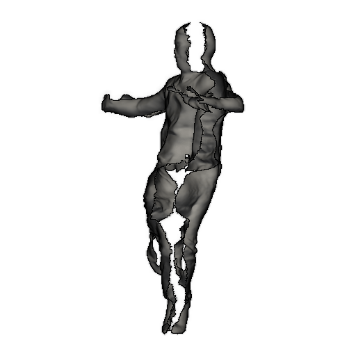
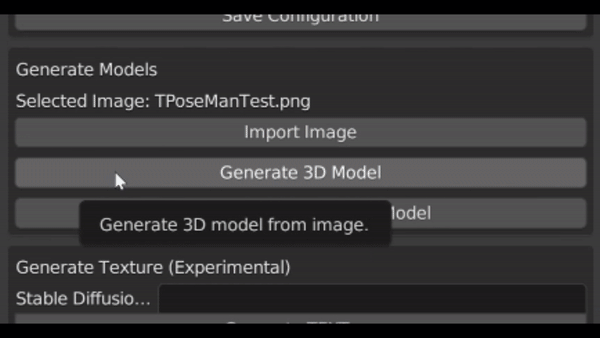
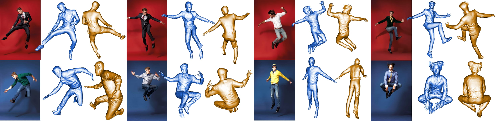
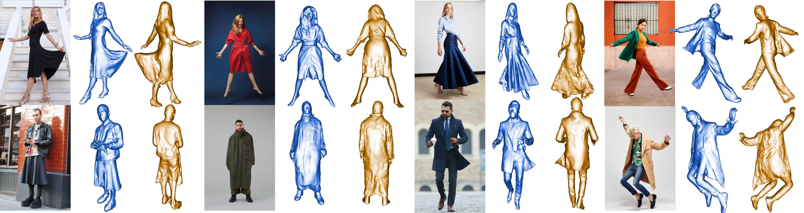
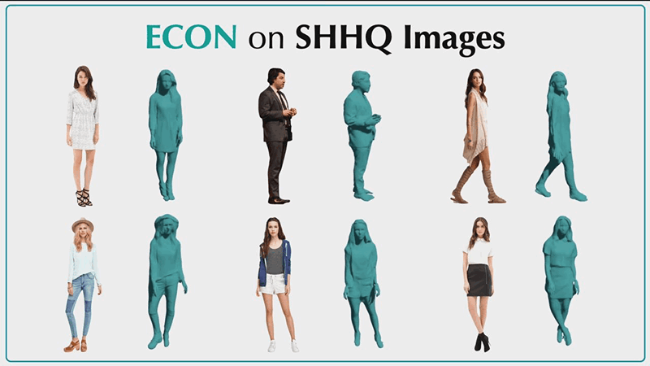

<!-- PROJECT LOGO -->

<p align="center">

  <h1 align="center">ECON: Explicit Clothed humans Optimized via Normal integration</h1>
  <p align="center">
    <a href="http://xiuyuliang.cn/"><strong>Yuliang Xiu</strong></a>
    ·
    <a href="https://ps.is.tuebingen.mpg.de/person/jyang"><strong>Jinlong Yang</strong></a>
    ·
    <a href="https://hoshino042.github.io/homepage/"><strong>Xu Cao</strong></a>
    ·
    <a href="https://ps.is.mpg.de/~dtzionas"><strong>Dimitrios Tzionas</strong></a>
    ·
    <a href="https://ps.is.tuebingen.mpg.de/person/black"><strong>Michael J. Black</strong></a>
  </p>
  <h2 align="center">CVPR 2023 (Highlight)</h2>
  <div align="center">
    
  </div>

  <p align="center">
  <br>
    <a href="https://pytorch.org/get-started/locally/"></a>
    <a href="https://pytorchlightning.ai/"></a>
    <a href="https://cupy.dev/"></a>
    <a href="https://twitter.com/yuliangxiu"></a>
    <a href="https://discord.gg/Vqa7KBGRyk"></a>
    <br></br>
    <a href='https://colab.research.google.com/drive/1YRgwoRCZIrSB2e7auEWFyG10Xzjbrbno?usp=sharing'></a>
    <a href="https://huggingface.co/spaces/Yuliang/ECON"  style='padding-left: 0.5rem;'></a>
    <a href='https://github.com/YuliangXiu/ECON/blob/master/docs/installation-docker.md'></a>
    <a href='https://carlosedubarreto.gumroad.com/l/CEB_ECON'></a>
    <br></br>
    <a href="https://arxiv.org/abs/2212.07422">
      
    </a>
    <a href='https://xiuyuliang.cn/econ/'>
      </a>
    <a href="https://youtu.be/5PEd_p90kS0"></a>
  </p>
</p>

<br/>

ECON is designed for "Human digitization from a color image", which combines the best properties of implicit and explicit representations, to infer high-fidelity 3D clothed humans from in-the-wild images, even with **loose clothing** or in **challenging poses**. ECON also supports **multi-person reconstruction** and **SMPL-X based animation**.
<br/>
<br/>

## News :triangular_flag_on_post:

- [2023/06/01] [Lee Kwan Joong](https://github.com/kwan3854) updates a Blender Addon ([Github](https://github.com/kwan3854/CEB_ECON), [Tutorial](https://youtu.be/SDVfCeaI4AY)).

- [2023/04/16] <a href="https://huggingface.co/spaces/Yuliang/ECON"  style='padding-left: 0.5rem;'></a> is ready to use!
- [2023/02/27] ECON got accepted by CVPR 2023 as Highlight (top 10%)!
- [2023/01/12] [Carlos Barreto](https://twitter.com/carlosedubarret/status/1613252471035494403) creates a Blender Addon ([Download](https://carlosedubarreto.gumroad.com/l/CEB_ECON), [Tutorial](https://youtu.be/sbWZbTf6ZYk)).
- [2023/01/08] [Teddy Huang](https://github.com/Teddy12155555) creates [install-with-docker](docs/installation-docker.md) for ECON .
- [2023/01/06] [Justin John](https://github.com/justinjohn0306) and [Carlos Barreto](https://github.com/carlosedubarreto) creates [install-on-windows](docs/installation-windows.md) for ECON .
- [2022/12/22] <a href='https://colab.research.google.com/drive/1YRgwoRCZIrSB2e7auEWFyG10Xzjbrbno?usp=sharing' style='padding-left: 0.5rem;'></a> is now available, created by [Aron Arzoomand](https://github.com/AroArz).
- [2022/12/15] Both <a href="#demo">demo</a> and <a href="https://arxiv.org/abs/2212.07422">arXiv</a> are available.


## Key idea: d-BiNI

d-BiNI jointly optimizes front-back 2.5D surfaces such that: (1) high-frequency surface details agree with normal maps, (2) low-frequency surface variations, including discontinuities, align with SMPL-X surfaces, and (3) front-back 2.5D surface silhouettes are coherent with each other.

|        Front-view        |        Back-view        |         Side-view         |
| :----------------------: | :---------------------: | :-----------------------: |
|  |  |  |

<details><summary>Please consider cite <strong>BiNI</strong> if it also helps on your project</summary>

```bibtex
@inproceedings{cao2022bilateral,
  title={Bilateral normal integration},
  author={Cao, Xu and Santo, Hiroaki and Shi, Boxin and Okura, Fumio and Matsushita, Yasuyuki},
  booktitle={Computer Vision--ECCV 2022: 17th European Conference, Tel Aviv, Israel, October 23--27, 2022, Proceedings, Part I},
  pages={552--567},
  year={2022},
  organization={Springer}
}
```

</details>

<br>

<!-- TABLE OF CONTENTS -->
<details open="open" style='padding: 10px; border-radius:5px 30px 30px 5px; border-style: solid; border-width: 1px;'>
  <summary>Table of Contents</summary>
  <ol>
    <li>
      <a href="#instructions">Instructions</a>
    </li>
    <li>
      <a href="#demo">Demo</a>
    </li>
    <li>
      <a href="#applications">Applications</a>
    </li>
    <li>
      <a href="#citation">Citation</a>
    </li>
  </ol>
</details>
<br/>

## Instructions

- See [installion doc for Docker](docs/installation-docker.md) to run a docker container with pre-built image for ECON demo
- See [installion doc for Windows](docs/installation-windows.md) to install all the required packages and setup the models on _Windows_
- See [installion doc for Ubuntu](docs/installation-ubuntu.md) to install all the required packages and setup the models on _Ubuntu_
- See [magic tricks](docs/tricks.md) to know a few technical tricks to further improve and accelerate ECON
- See [testing](docs/testing.md) to prepare the testing data and evaluate ECON

## Demo


- Terminal

```bash
# For single-person image-based reconstruction (w/ l visualization steps, 1.8min)
python -m apps.infer -cfg ./configs/econ.yaml -in_dir ./examples -out_dir ./results

# For multi-person image-based reconstruction (see config/econ.yaml)
python -m apps.infer -cfg ./configs/econ.yaml -in_dir ./examples -out_dir ./results -multi

# To generate the demo video of reconstruction results
python -m apps.multi_render -n <filename>

# To animate the reconstruction with SMPL-X pose parameters
python -m apps.avatarizer -n <filename>
```

- Gradio Demo

We also provide a UI for testing our method that is built with gradio. This demo also supports pose&prompt guided human image generation! Running the following command in a terminal will launch the demo:

```bash
git checkout main
python app.py
```

This demo is also hosted on HuggingFace Space <a href="https://huggingface.co/spaces/Yuliang/ECON"  style='padding-left: 0.5rem;'></a>

- Full Texture Generation 

Please firstly follow the [TEXTure's installation](https://github.com/YuliangXiu/TEXTure#installation-floppy_disk) to setup the env of TEXTure.

```bash
git clone https://github.com/YuliangXiu/TEXTure
cd TEXTure
ln -s ../ECON/results/econ/cache
python -m scripts.run_texture --config_path=configs/text_guided/avatar.yaml
```

Then check `./experiments/<filename>/mesh` for the results.

- Blender all in one add-on

This [Blender add-on](https://github.com/kwan3854/CEB_ECON) supports the use of single-person reconstruction, avatarizer, and TEXTure features. It also provides the functionality to adjust configuration settings as required.



<br/>

## More Qualitative Results

|      |
| :------------------------------------: |
|          _Challenging Poses_           |
|  |
|            _Loose Clothes_             |

## Applications

|                                                                                |                   |
| :----------------------------------------------------------------------------------------------------: | :-----------------------------------------: |
| _ECON could provide pseudo 3D GT for [SHHQ Dataset](https://github.com/stylegan-human/StyleGAN-Human)_ | _ECON supports multi-person reconstruction_ |

<br/>
<br/>

## Citation

```bibtex
@inproceedings{xiu2023econ,
  title     = {{ECON: Explicit Clothed humans Optimized via Normal integration}},
  author    = {Xiu, Yuliang and Yang, Jinlong and Cao, Xu and Tzionas, Dimitrios and Black, Michael J.},
  booktitle = {Proceedings of the IEEE/CVF Conference on Computer Vision and Pattern Recognition (CVPR)},
  month     = {June},
  year      = {2023},
}
```

<br/>

## Acknowledgments

We thank [Lea Hering](https://is.mpg.de/person/lhering) and [Radek Daněček](https://is.mpg.de/person/rdanecek) for proof reading, [Yao Feng](https://ps.is.mpg.de/person/yfeng), [Haven Feng](https://is.mpg.de/person/hfeng), and [Weiyang Liu](https://wyliu.com/) for their feedback and discussions, [Tsvetelina Alexiadis](https://ps.is.mpg.de/person/talexiadis) for her help with the AMT perceptual study.

Here are some great resources we benefit from:

- [ICON](https://github.com/YuliangXiu/ICON) for SMPL-X Body Fitting
- [BiNI](https://github.com/hoshino042/bilateral_normal_integration) for Bilateral Normal Integration
- [MonoPortDataset](https://github.com/Project-Splinter/MonoPortDataset) for Data Processing, [MonoPort](https://github.com/Project-Splinter/MonoPort) for fast implicit surface query
- [rembg](https://github.com/danielgatis/rembg) for Human Segmentation
- [MediaPipe](https://google.github.io/mediapipe/getting_started/python.html) for full-body landmark estimation
- [PyTorch-NICP](https://github.com/wuhaozhe/pytorch-nicp) for non-rigid registration
- [smplx](https://github.com/vchoutas/smplx), [PyMAF-X](https://www.liuyebin.com/pymaf-x/), [PIXIE](https://github.com/YadiraF/PIXIE) for Human Pose & Shape Estimation
- [CAPE](https://github.com/qianlim/CAPE) and [THuman](https://github.com/ZhengZerong/DeepHuman/tree/master/THUmanDataset) for Dataset
- [PyTorch3D](https://github.com/facebookresearch/pytorch3d) for Differential Rendering

Some images used in the qualitative examples come from [pinterest.com](https://www.pinterest.com/).

This project has received funding from the European Union’s Horizon 2020 research and innovation programme under the Marie Skłodowska-Curie grant agreement No.860768 ([CLIPE Project](https://www.clipe-itn.eu)).

## Contributors

Kudos to all of our amazing contributors! ECON thrives through open-source. In that spirit, we welcome all kinds of contributions from the community.

<a href="https://github.com/yuliangxiu/ECON/graphs/contributors">
  
</a>

_Contributor avatars are randomly shuffled._

---

<br>

## License

This code and model are available for non-commercial scientific research purposes as defined in the [LICENSE](LICENSE) file. By downloading and using the code and model you agree to the terms in the [LICENSE](LICENSE).

## Disclosure

MJB has received research gift funds from Adobe, Intel, Nvidia, Meta/Facebook, and Amazon. MJB has financial interests in Amazon, Datagen Technologies, and Meshcapade GmbH. While MJB is a part-time employee of Meshcapade, his research was performed solely at, and funded solely by, the Max Planck Society.

## Contact

For technical questions, please contact yuliang.xiu@tue.mpg.de

For commercial licensing, please contact ps-licensing@tue.mpg.de
