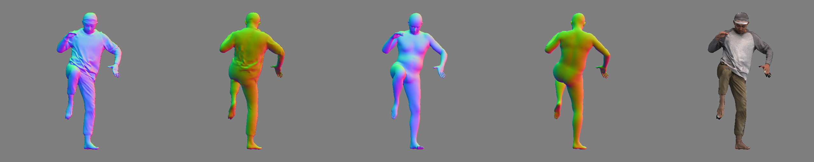

## CAPE Testset



```bash
# 1. Register at http://icon.is.tue.mpg.de/ or https://cape.is.tue.mpg.de/
# 2. Download CAPE testset (Easy: 50, Hard: 100)
bash fetch_cape.sh 

# 3. Check CAPE testset via 3D visualization
python -m lib.dataloader_demo -v -c ./configs/train/icon-filter.yaml -d cape
```

## Command

```bash
conda activate icon

# model_type: 
#   "pifu"            reimplemented PIFu
#   "pamir"           reimplemented PaMIR
#   "icon-filter"     ICON w/ global encoder (continous local wrinkles)
#   "icon-nofilter"   ICON w/o global encoder (correct global pose)

python -m apps.train -cfg ./configs/train/icon-filter.yaml -test

# TIP: reduce "mcube_res" as 128 in apps/train.py for faster evaluation
```

The qualitative results are located at `./results/icon-filter`

<br>

## Benchmark (train on THuman2.0, test on CAPE)

|Method|PIFu|PaMIR|ICON|ICON-filter|ICON-keypoint|
|:---:|:---:|:---:|:---:|:---:|:---:|
|Chamfer(cm)|3.573|1.682|1.533|**1.424**|1.539|
|P2S(cm)|1.483|1.438|1.431|**1.351**|1.358|
|NC|0.186|0.119|**0.090**|0.101|0.109|

:boom: ICON-keypoint leverages the core insight **Relative Spatial Encoder** from [KeypointNeRF](https://markomih.github.io/KeypointNeRF/), and replace it with the SMPL-based SDF. This leads to comparable reconstruction quality, but much faster and convenient. 

<br>

## Citation

:+1: Please cite these CAPE-related papers

```
@inproceedings{CAPE:CVPR:20,
  title = {{Learning to Dress 3D People in Generative Clothing}},
  author = {Ma, Qianli and Yang, Jinlong and Ranjan, Anurag and Pujades, Sergi and Pons-Moll, Gerard and Tang, Siyu and Black, Michael J.},
  booktitle = {Computer Vision and Pattern Recognition (CVPR)},
  month = June,
  year = {2020},
  month_numeric = {6}
}

@article{Pons-Moll:Siggraph2017,
  title = {ClothCap: Seamless 4D Clothing Capture and Retargeting},
  author = {Pons-Moll, Gerard and Pujades, Sergi and Hu, Sonny and Black, Michael},
  journal = {ACM Transactions on Graphics, (Proc. SIGGRAPH)},
  volume = {36},
  number = {4},
  year = {2017},
  note = {Two first authors contributed equally},
  crossref = {},
  url = {http://dx.doi.org/10.1145/3072959.3073711}
}
```