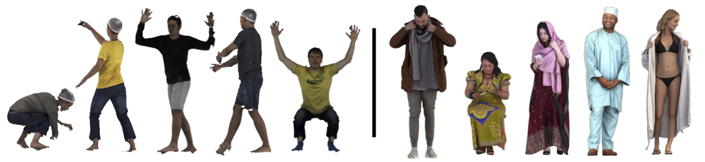

# Evaluation

## Testing Data



- OOD pose (CAPE, [download](https://github.com/YuliangXiu/ICON/blob/master/docs/evaluation.md#cape-testset)): [`pose.txt`](../pose.txt)
- OOD outfits (RenderPeople, [commercial scans](https://renderpeople.com/), [SMPL(-X) fits](https://agora.is.tue.mpg.de/)): [`loose.txt`](../loose.txt)

## Run the evaluation

```bash
# Benchmark of ECON_{IF}, which uses IF-Net+ for completion
export CUDA_VISIBLE_DEVICES=0; python -m apps.benchmark -ifnet

# Benchmark of ECON_{EX}, which uses registered SMPL for completion
export CUDA_VISIBLE_DEVICES=1; python -m apps.benchmark

```

## Benchmark

|   Method    |  $\text{ECON}_\text{IF}$  | $\text{ECON}_\text{EX}$ |
| :---------: | :-----------------------: | :---------------------: |
|             |     OOD poses (CAPE)      |                         |
| Chamfer(cm) |           0.996           |        **0.926**        |
|   P2S(cm)   |           0.967           |        **0.917**        |
| Normal(L2)  |          0.0413           |       **0.0367**        |
|             | OOD oufits (RenderPeople) |                         |
| Chamfer(cm) |           1.401           |        **1.342**        |
|   P2S(cm)   |         **1.422**         |          1.458          |
| Normal(L2)  |          0.0516           |       **0.0478**        |

**\*OOD: Out-of-Distribution**

## Baselines with code+models

|            |                        PIFu                        |                          PIFuHD                           |                       PaMIR                        |                    ARCH                    |                    CAR                     |                    ICON                    |                    ECON                    |
| :--------: | :------------------------------------------------: | :-------------------------------------------------------: | :------------------------------------------------: | :----------------------------------------: | :----------------------------------------: | :----------------------------------------: | :----------------------------------------: |
|  official  |   [PIFu ](https://github.com/shunsukesaito/PIFu)   |  [PIFuHD\*](https://github.com/facebookresearch/pifuhd)   |   [PaMIR](https://github.com/ZhengZerong/PaMIR)    |                     -                      | [CAR](https://github.com/TingtingLiao/CAR) | [ICON](https://github.com/YuliangXiu/ICON) | [ECON](https://github.com/YuliangXiu/ECON) |
| unofficial | [ICON &#8593;](https://github.com/YuliangXiu/ICON) | [Open-PIFuHD](https://github.com/lingtengqiu/Open-PIFuhd) | [ICON &#8593;](https://github.com/YuliangXiu/ICON) | [CAR](https://github.com/TingtingLiao/CAR) |                     -                      |                     -                      |                     -                      |

**\* test only, w/o training code**

**&#8593; better performance than official version**

<details><summary>Please cite these baselines in experiment section or related works</summary>

```bibtex
@inproceedings{saito2019pifu,
    author      = {Shunsuke Saito and Zeng Huang and Ryota Natsume and Shigeo Morishima and Hao Li and Angjoo Kanazawa},
    title       = {{PIFu}: {P}ixel-Aligned Implicit Function for High-Resolution Clothed Human Digitization},
    booktitle   = ICCV,
    year        = {2019}
}

@inproceedings{saito2020pifuhd,
    title       = {{PIFuHD}: {M}ulti-Level Pixel-Aligned Implicit Function for High-Resolution {3D} Human Digitization},
    author      = {Shunsuke Saito and Tomas Simon and Jason M. Saragih and Hanbyul Joo},
    booktitle   = CVPR,
    year        = {2020}
}

@article{zheng2020pamir,
    title       = {{PaMIR}: {P}arametric Model-Conditioned Implicit Representation for Image-based Human Reconstruction},
    author      = {Zerong Zheng and Tao Yu and Yebin Liu and Qionghai Dai},
    journal     = PAMI,
    year        = {2022}
}

@inproceedings{huang2020arch,
    title       = {{ARCH}: {A}nimatable Reconstruction of Clothed Humans},
    author      = {Zeng Huang and Yuanlu Xu and Christoph Lassner and Hao Li and Tony Tung},
    booktitle   = CVPR,
    year        = {2020}
}

@inproceedings{liao2023car,
  title     = {{High-Fidelity Clothed Avatar Reconstruction from a Single Image}},
  author    = {Liao, Tingting and Zhang, Xiaomei and Xiu, Yuliang and Yi, Hongwei and Liu, Xudong and Qi, Guo-Jun and Zhang, Yong and Wang, Xuan and Zhu, Xiangyu and Lei, Zhen},
  booktitle = CVPR,
  year      = {2023},
}

@inproceedings{xiu2022icon,
    title       = {{ICON}: {I}mplicit {C}lothed humans {O}btained from {N}ormals},
    author      = {Xiu, Yuliang and Yang, Jinlong and Tzionas, Dimitrios and Black, Michael J.},
    booktitle   = CVPR,
    year        = {2022}
}

@inproceedings{xiu2023econ,
  title     = {{ECON: Explicit Clothed humans Optimized via Normal integration}},
  author    = {Xiu, Yuliang and Yang, Jinlong and Cao, Xu and Tzionas, Dimitrios and Black, Michael J.},
  booktitle = CVPR,
  year      = {2023},
}


```

</details>
<br>

## Citation

:+1: Please cite these CAPE-related papers

```

@inproceedings{xiu2022icon,
  title     = {{ICON}: {I}mplicit {C}lothed humans {O}btained from {N}ormals},
  author    = {Xiu, Yuliang and Yang, Jinlong and Tzionas, Dimitrios and Black, Michael J.},
  booktitle = {Proceedings of the IEEE/CVF Conference on Computer Vision and Pattern Recognition (CVPR)},
  month     = {June},
  year      = {2022},
  pages     = {13296-13306}
}

@inproceedings{CAPE:CVPR:20,
  title = {{Learning to Dress 3D People in Generative Clothing}},
  author = {Ma, Qianli and Yang, Jinlong and Ranjan, Anurag and Pujades, Sergi and Pons-Moll, Gerard and Tang, Siyu and Black, Michael J.},
  booktitle = {Computer Vision and Pattern Recognition (CVPR)},
  month = June,
  year = {2020},
  month_numeric = {6}
}

@article{Pons-Moll:Siggraph2017,
  title = {ClothCap: Seamless 4D Clothing Capture and Retargeting},
  author = {Pons-Moll, Gerard and Pujades, Sergi and Hu, Sonny and Black, Michael},
  journal = {ACM Transactions on Graphics, (Proc. SIGGRAPH)},
  volume = {36},
  number = {4},
  year = {2017},
  note = {Two first authors contributed equally},
  crossref = {},
  url = {http://dx.doi.org/10.1145/3072959.3073711}
}
```
